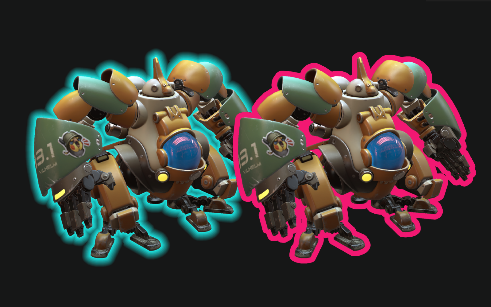

# three-jumpflood-demo

Demonstration showing application of the [Jump Flood Algorithm](https://en.wikipedia.org/wiki/Jump_flooding_algorithm) for realtime effects like model silhouette outline and glow. Based in part on the concepts described in [this article by Ben Golus](https://bgolus.medium.com/the-quest-for-very-wide-outlines-ba82ed442cd9).

Demo [here](https://gkjohnson.github.io/three-jumpflood-demo/)! 

<i>Silhouette glow and outline effects in real time. </i>

**Model Attribution**

- Chicken robot model courtesy of [artjamayka on SketchFab](https://sketchfab.com/3d-models/vilhelm-13-low-res-textures-cb49a1f71ba54cad8e9dc09da8ef47cd).
- Terrarium robots model courtesy [nyancube on SketchFab](https://sketchfab.com/3d-models/terrarium-bots-nerdscribbles-bf9a19aae6914a2c866311887edc8b3e).
- M2020 Rover model courtesy of NASA/Caltech-JPL.

## Potential Improvements

- Improved outline anti-aliasing referencing the above article.
- Limit the the jump flood operation range using stencil tests rather than operating on the full screen / scissor.
- Use lower precision textures.
- Investigate lower-resolution textures for jump flood stage, like half float - possibly requires using UV coordinates rather than pixel values.
